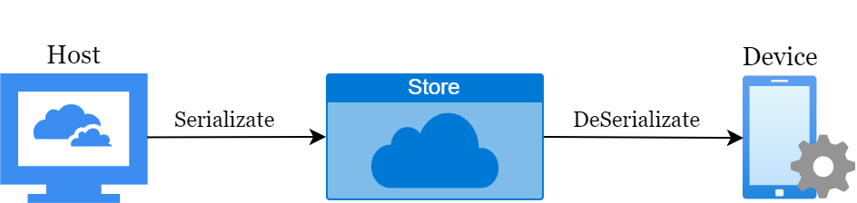

# 项目中的 load dump 序列化

> 背景：不同设备之间传输数据时，如果结构体成员内只有数组或者 `POD` 类型，可以使用 `fwrite` 和 `fread`。当存在 `string` 或者 `vector` 类型时，手动 `fwrite` 和 `fread` 就会导致代码冗余。



于是自己实现了一个序列化和反序列化的接口，适用于单次传输数据，`host` 端导出数据后，在 `device` 端导入数据并检查或者做点其他的什么计算。

- 模板特化和 `SFINAE` 实现类型无感
- 字节流处理实现序列化和反序列化
- 支持 `POD` 类型，`string`，`vector`，自定义结构体参数

## build

`linux` 端测试执行：

```
mkdir build
cd build
cmake ..
make
./main
```

## use

如果项目需要，把 `include` 目录搬走就行。使用方式可以参考 `main.cpp`。

### POD， string 和 vector

```cpp
OutStream output;
std::vector<double> vec;
int a = 13;
char c = 'c';
vec.push_back(3.14);
vec.push_back(9);
output << a << vec << c;         // host 端，序列化数据并保存
output.Save("para.raw");
```

```cpp
InStream input;
input.Read("para.raw");          // 模拟 device 端，读取数据，反序列化到数据中
input >> b >> vec1 >> d;
```

### 自定义类

```cpp
OutStream output;
Benchmark ben;                      // host 端的参数

DumpBenchmark dump_bench;           // DumpBenchmark 是自定义的序列化子类，
dump_bench.bench = ben;             // DumpBenchmark 包含 host 的参数

output << dump_bench;               // 序列化 host 端的参数
output.Save("para.raw");
```

```cpp
InStream input;                     // device 端代码
DumpBenchmark dump_bench1;          // device 端执行时，直接反序列化 host 端的参数
input.Read("para.raw");
input >> dump_bench1;               // device 端一步拿到 host 的参数
```